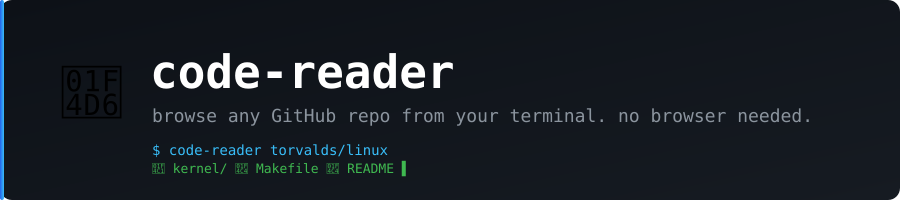

<p align="center">
  
</p>

<p align="center">
  <b>Browse any GitHub repository from your terminal. File tree, syntax highlighting, repo stats.</b>
</p>

<p align="center">
  
  
  
  
  
</p>

---

`code-reader` is a terminal UI for exploring GitHub repositories without leaving the command line. Browse the file tree, read source files with syntax highlighting, and get a quick overview of any repo's stats and language breakdown — all from a clean split-pane interface.

Good for quickly exploring an unfamiliar codebase, checking a dependency's source, or reviewing a PR without switching to the browser.

## What it looks like

```
┌─────────────────────────────┬────────────────────────────────────────────┐
│ 📁 torvalds/linux            │  1  // SPDX-License-Identifier: GPL-2.0   │
│                              │  2  #include <linux/module.h>              │
│ 📁 arch/                     │  3  #include <linux/kernel.h>              │
│ 📁 drivers/                  │  4                                         │
│ 📁 fs/                       │  5  static int __init hello_init(void)     │
│ 📁 include/                  │  6  {                                      │
│ 📁 kernel/                   │  7      pr_info("Hello, world!\n");        │
│   📄 Makefile                │  8      return 0;                          │
│   📄 README                  │  9  }                                      │
│ > 📄 init/main.c             │                                            │
└─────────────────────────────┴────────────────────────────────────────────┘
```

## Features

- **Browse any public GitHub repo** — file tree with icons, directories first
- **Syntax highlighting** — Dracula theme, line numbers, 50+ languages out of the box
- **Repository overview** — stars, forks, open issues, language breakdown with visual bars, topics
- **All file types** — Rust, Go, Python, YAML, TOML, Markdown — if GitHub shows it, so does this
- **Auto-authentication** — picks up your `gh` CLI token, `GITHUB_TOKEN` env var, or a local `.env` file. Works unauthenticated too (rate-limited)
- **Keyboard-first** — no mouse required

## Install

Requires [uv](https://docs.astral.sh/uv/):

```bash
git clone https://github.com/alvaropma/code-reader.git
cd code-reader
uv sync
```

## Usage

```bash
# Interactive — prompts for a repo name
uv run python app.py

# Direct — pass owner/repo as argument
uv run python app.py torvalds/linux
uv run python app.py psf/requests
uv run python app.py vercel/next.js
```

## Keybindings

| Key | Action |
|-----|--------|
| Enter | Load repo / open selected file |
| ↑ ↓ | Navigate file tree |
| Ctrl+O | Show repository overview (stats, languages, topics) |
| Esc | Go back to input / quit |

## Authentication

`code-reader` works without authentication but you'll hit GitHub's anonymous rate limit (60 req/h) quickly on large repos. To authenticate:

1. **gh CLI** (recommended): just run `gh auth login` — code-reader picks it up automatically
2. **Environment variable**: `export GITHUB_TOKEN=your_token`
3. **`.env` file**: create a `.env` in the project root with `GITHUB_TOKEN=your_token`

## Requirements

- Python 3.9+
- [uv](https://docs.astral.sh/uv/)
- A GitHub account (optional but recommended for rate limits)

## License

MIT
